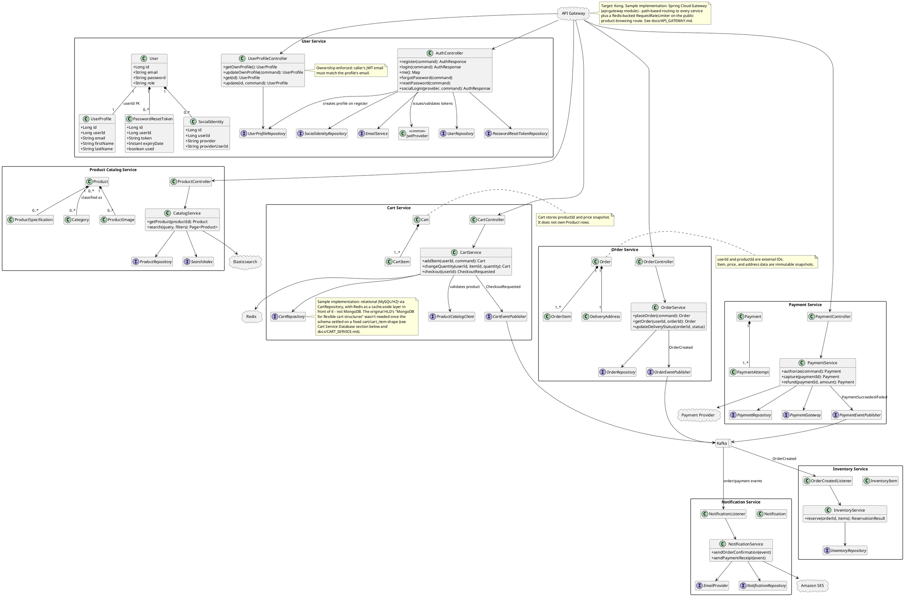

# Ecommerce Low-Level Design

This document defines the target service boundaries from the PRD. Each microservice owns its data store; identifiers belonging to another service are value references, not cross-database foreign keys. This preserves independent deployment and schema ownership.

> **Target design vs. current sample.** This LLD describes the full production-grade design (all 7 services, real payment gateway, Amazon SES, Kong, UUID keys, order/payment audit tables, etc.). The actual code in this repo is a deliberately smaller interview-learning slice of it - see [docs/SCOPE_DEVIATIONS.md](docs/SCOPE_DEVIATIONS.md) for exactly what was simplified and why (e.g. `BIGINT` identity keys instead of `UUID`, Spring Cloud Gateway instead of Kong, a mock payment gateway, a logging-only email provider). Read the two side by side: this file for "how would you design it for scale", the `docs/` files for "here's a working, runnable version".

## Class Diagram

## Database Schema Diagram

```plantuml
@startuml EcommerceDatabaseSchema
left to right direction
hide circle
skinparam linetype ortho
skinparam shadowing false

package "User Service Database" {
  entity "users" as users {
    * id : BIGINT <<PK>>
    --
    * email : VARCHAR(320) <<UK>>
    * password_hash : VARCHAR(255)
    * status : VARCHAR(32)
    * created_at : TIMESTAMP
    * updated_at : TIMESTAMP
    --
    INDEX ix_users_status_created (status, created_at)
  }
  entity "social_identities" as social_identities {
    * id : BIGINT <<PK>>
    --
    * user_id : BIGINT <<FK>>
    * provider : VARCHAR(40)
    * provider_subject : VARCHAR(255)
    * created_at : TIMESTAMP
    --
    UK (provider, provider_subject)
    INDEX ix_social_identities_user_id (user_id)
  }
  entity "password_reset_tokens" as password_reset_tokens {
    * id : BIGINT <<PK>>
    --
    * user_id : BIGINT <<FK>>
    * token_hash : CHAR(64) <<UK>>
    * expires_at : TIMESTAMP
    used_at : TIMESTAMP NULL
    * created_at : TIMESTAMP
    --
    INDEX ix_reset_tokens_user_id (user_id)
    INDEX ix_reset_tokens_expiry (expires_at)
  }
  entity "user_profiles" as user_profiles {
    * user_id : BIGINT <<PK, FK: users.id>>
    --
    first_name : VARCHAR(100)
    last_name : VARCHAR(100)
    phone : VARCHAR(30)
    * created_at : TIMESTAMP
    * updated_at : TIMESTAMP
    --
    INDEX ix_user_profiles_phone (phone)
  }
  entity "addresses" as addresses {
    * id : BIGINT <<PK>>
    --
    * user_id : BIGINT <<FK, external: users.id>>
    * recipient_name : VARCHAR(200)
    * line1 : VARCHAR(200)
    line2 : VARCHAR(200) NULL
    * city : VARCHAR(100)
    * region : VARCHAR(100)
    * postal_code : VARCHAR(30)
    * country_code : CHAR(2)
    * is_default : BOOLEAN
    * created_at : TIMESTAMP
    * updated_at : TIMESTAMP
    --
    INDEX ix_addresses_user_id (user_id)
  }
  users ||--o{ social_identities
  users ||--o{ password_reset_tokens
  users ||--|| user_profiles : real FK (same schema, merged service)
  user_profiles ||--o{ addresses
}

package "Product Service Database" {
  entity "products" as products {
    * id : BIGINT <<PK>>
    --
    * sku : VARCHAR(64) <<UK>>
    * name : VARCHAR(255)
    * description : TEXT
    * price : DECIMAL(19,4)
    * currency : CHAR(3)
    * status : VARCHAR(32)
    * created_at : TIMESTAMP
    * updated_at : TIMESTAMP
    --
    INDEX ix_products_status_created (status, created_at)
    INDEX ix_products_name (name)
  }
  entity "categories" as categories {
    * id : BIGINT <<PK>>
    --
    parent_id : BIGINT <<FK, nullable>>
    * name : VARCHAR(120)
    * slug : VARCHAR(140) <<UK>>
    * created_at : TIMESTAMP
    * updated_at : TIMESTAMP
    --
    INDEX ix_categories_parent_id (parent_id)
  }
  entity "product_categories" as product_categories {
    * product_id : BIGINT <<PK, FK>>
    * category_id : BIGINT <<PK, FK>>
    --
    * assigned_at : TIMESTAMP
    --
    INDEX ix_product_categories_category_id (category_id)
  }
  entity "product_images" as product_images {
    * id : BIGINT <<PK>>
    --
    * product_id : BIGINT <<FK>>
    * url : VARCHAR(2048)
    * alt_text : VARCHAR(255)
    * sort_order : SMALLINT
    --
    UK (product_id, sort_order)
  }
  entity "product_specifications" as product_specifications {
    * id : BIGINT <<PK>>
    --
    * product_id : BIGINT <<FK>>
    * spec_key : VARCHAR(100)
    * spec_value : VARCHAR(1000)
    --
    UK (product_id, spec_key)
  }
  products ||--o{ product_categories
  categories ||--o{ product_categories
  categories ||--o{ categories : parent/child
  products ||--o{ product_images
  products ||--o{ product_specifications

  note bottom of products
    Sample implementation collapses this into a single
    Product entity with one @ManyToOne Category (no
    product_images/product_specifications/many-to-many
    tables), plus a parallel Elasticsearch "products" index
    for keyword search. See docs/ELASTICSEARCH_SEARCH.md.
  end note
}

package "Cart Service Database" {
  entity "carts" as carts {
    * id : BIGINT <<PK>>
    --
    * user_id : BIGINT <<external: users.id, UK>>
    * status : VARCHAR(32)
    * currency : CHAR(3)
    * expires_at : TIMESTAMP
    * created_at : TIMESTAMP
    * updated_at : TIMESTAMP
    --
    INDEX ix_carts_status_expiry (status, expires_at)
  }
  entity "cart_items" as cart_items {
    * id : BIGINT <<PK>>
    --
    * cart_id : BIGINT <<FK>>
    * product_id : BIGINT <<external: products.id>>
    * sku_snapshot : VARCHAR(64)
    * product_name_snapshot : VARCHAR(255)
    * unit_price : DECIMAL(19,4)
    * quantity : INT
    * added_at : TIMESTAMP
    * updated_at : TIMESTAMP
    --
    UK (cart_id, product_id)
    INDEX ix_cart_items_product_id (product_id)
  }
  carts ||--|{ cart_items

  note bottom of carts
    Why not MongoDB (as the original HLD proposed)? The cart
    shape never varies (a list of {productId, name, price,
    quantity}), so there's no schema-flexibility benefit -
    and staying relational meant one less datastore to
    operate. Redis sits in front as a cache-aside layer for
    the hot "get my cart" read path instead. See
    docs/CART_SERVICE.md and docs/REDIS_CACHING.md.
  end note
}

package "Order Service Database" {
  entity "orders" as orders {
    * id : BIGINT <<PK>>
    --
    * order_number : VARCHAR(40) <<UK>>
    * user_id : BIGINT <<external: users.id>>
    * status : VARCHAR(32)
    * subtotal_amount : DECIMAL(19,4)
    * tax_amount : DECIMAL(19,4)
    * shipping_amount : DECIMAL(19,4)
    * total_amount : DECIMAL(19,4)
    * currency : CHAR(3)
    * placed_at : TIMESTAMP
    * created_at : TIMESTAMP
    * updated_at : TIMESTAMP
    --
    INDEX ix_orders_user_placed (user_id, placed_at)
    INDEX ix_orders_status_created (status, created_at)
  }
  entity "order_items" as order_items {
    * id : BIGINT <<PK>>
    --
    * order_id : BIGINT <<FK>>
    * product_id : BIGINT <<external: products.id>>
    * sku_snapshot : VARCHAR(64)
    * product_name_snapshot : VARCHAR(255)
    * unit_price : DECIMAL(19,4)
    * quantity : INT
    * line_total : DECIMAL(19,4)
    --
    INDEX ix_order_items_order_id (order_id)
    INDEX ix_order_items_product_id (product_id)
  }
  entity "order_delivery_addresses" as order_delivery_addresses {
    * order_id : BIGINT <<PK, FK>>
    --
    * recipient_name : VARCHAR(200)
    * line1 : VARCHAR(200)
    line2 : VARCHAR(200) NULL
    * city : VARCHAR(100)
    * region : VARCHAR(100)
    * postal_code : VARCHAR(30)
    * country_code : CHAR(2)
  }
  entity "order_status_history" as order_status_history {
    * id : BIGINT <<PK>>
    --
    * order_id : BIGINT <<FK>>
    * status : VARCHAR(32)
    note : VARCHAR(1000) NULL
    * occurred_at : TIMESTAMP
    --
    INDEX ix_order_status_history_order_time (order_id, occurred_at)
  }
  orders ||--|{ order_items
  orders ||--|| order_delivery_addresses
  orders ||--o{ order_status_history

  note bottom of orders
    Sample implementation stores delivery_address as a
    single VARCHAR column on orders (no order_number,
    tax/shipping split, or status-history audit table) and
    derives status transitions from the Kafka saga instead
    of a dedicated history table. See docs/ORDER_SAGA_FLOW.md.
  end note
}

package "Payment Service Database" {
  entity "payments" as payments {
    * id : BIGINT <<PK>>
    --
    * order_id : BIGINT <<external: orders.id, UK>>
    * user_id : BIGINT <<external: users.id>>
    * amount : DECIMAL(19,4)
    * currency : CHAR(3)
    * method_type : VARCHAR(32)
    * status : VARCHAR(32)
    * created_at : TIMESTAMP
    * updated_at : TIMESTAMP
    --
    INDEX ix_payments_user_created (user_id, created_at)
    INDEX ix_payments_status_created (status, created_at)
  }
  entity "payment_attempts" as payment_attempts {
    * id : BIGINT <<PK>>
    --
    * payment_id : BIGINT <<FK>>
    * idempotency_key : VARCHAR(128) <<UK>>
    * gateway : VARCHAR(50)
    gateway_transaction_id : VARCHAR(255) NULL
    * status : VARCHAR(32)
    * amount : DECIMAL(19,4)
    * attempted_at : TIMESTAMP
    failure_code : VARCHAR(100) NULL
    --
    UK (gateway, gateway_transaction_id)
    INDEX ix_payment_attempts_payment_time (payment_id, attempted_at)
  }
  entity "payment_receipts" as payment_receipts {
    * id : BIGINT <<PK>>
    --
    * payment_id : BIGINT <<FK, UK>>
    * receipt_number : VARCHAR(64) <<UK>>
    * issued_at : TIMESTAMP
    receipt_url : VARCHAR(2048) NULL
  }
  payments ||--|{ payment_attempts
  payments ||--o| payment_receipts

  note bottom of payments
    Sample implementation uses a mock PaymentGateway (no real
    gateway/idempotency-key/receipt fields) - see
    docs/PAYMENT_SERVICE.md.
  end note
}

package "Inventory Service Database" {
  entity "inventory" as inventory {
    * id : BIGINT <<PK>>
    --
    * product_id : BIGINT <<external: products.id, UK>>
    * quantity : INT
    --
    INDEX ix_inventory_product_id (product_id)
  }

  note bottom of inventory
    Reservation is all-or-nothing per order: OrderCreated is
    only applied if every line item has enough quantity;
    otherwise nothing is decremented and
    InventoryReservationFailed is published. A PaymentFailed
    event releases (increments back) the reserved quantity -
    the saga's compensating transaction. No separate
    "reserved vs. available" column in the sample (a real
    system would split these to allow overselling protection
    during the pending window). See docs/ORDER_SAGA_FLOW.md.
  end note
}

package "Notification Service Database" {
  entity "notifications" as notifications {
    * id : BIGINT <<PK>>
    --
    * user_id : BIGINT <<external: users.id>>
    * order_id : BIGINT <<external: orders.id>>
    * type : VARCHAR(32)
    * message : VARCHAR(1000)
    * sent_at : TIMESTAMP
    --
    INDEX ix_notifications_user_sent (user_id, sent_at)
  }

  note bottom of notifications
    One row per "email" attempt, written by the same call
    that invokes EmailProvider - lets you inspect what would
    have been sent without a real SES/SMTP integration. See
    docs/NOTIFICATION_SERVICE.md.
  end note
}

' Keep independently owned database schemas in a vertical reading order.
users -[hidden]down-> user_profiles
user_profiles -[hidden]down-> products
products -[hidden]down-> carts
carts -[hidden]down-> orders
orders -[hidden]down-> payments
payments -[hidden]down-> inventory
inventory -[hidden]down-> notifications

note bottom
  Physical foreign keys exist only within the same package/database.
  Application services validate external IDs and consume domain events.
end note
@enduml
```

`<<external reference>>` columns refer to records owned by another service, so they must be indexed but are not foreign keys. Monetary values use `DECIMAL(19,4)`. Unique constraints and indexes are included in the entity metadata.

