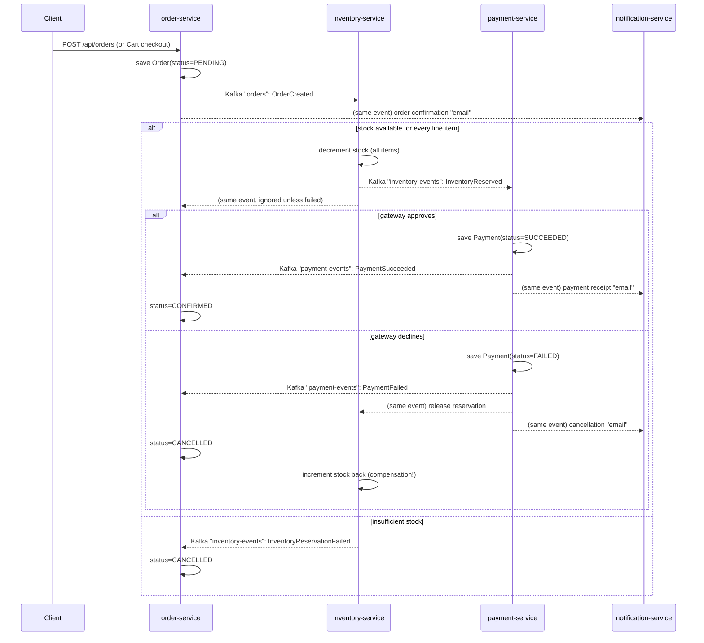

# Order/Inventory/Payment Saga — Concepts, Flow, and Repo Mapping

Goal: understand the **Saga pattern** (distributed transactions without a 2-phase commit), see it implemented end-to-end across four services, and be able to explain/whiteboard it in an interview.

## 1) The problem it solves

A single "place an order" business transaction touches data owned by three different services/databases:
- `order-service` — the order itself
- `inventory-service` — stock levels
- `payment-service` — the charge

You cannot wrap a write to three separate databases in one ACID transaction (no distributed 2PC across microservices in practice — it doesn't scale and couples availability). The **Saga pattern** solves this by breaking the transaction into a sequence of local transactions, each publishing an event that triggers the next step. If a later step fails, earlier steps run **compensating transactions** to undo their work.

There are two saga styles:
- **Choreography** (what this repo uses): each service listens for events and decides what to do next. No central coordinator.
- **Orchestration**: a central "saga orchestrator" service tells each participant what to do and tracks state explicitly. (Not implemented here — see "Interview talking points" below for when you'd choose it instead.)

## 2) The flow in this repo

### Kafka topics involved

| Topic | Producer | Consumers | Payload |
|---|---|---|---|
| `orders` | `order-service` (`OrderPublisher`) | `inventory-service`, `notification-service` | `{orderId, userId, totalAmount, items[]}` |
| `checkout-requested` | `cart-service` (`CartEventPublisher`) | `order-service` | `{userId, deliveryAddress, totalAmount, items[]}` |
| `inventory-events` | `inventory-service` (`InventoryEventPublisher`) | `payment-service`, `order-service` | `InventoryReserved` (echoes items/amount) or `InventoryReservationFailed` |
| `payment-events` | `payment-service` (`PaymentEventPublisher`) | `order-service`, `inventory-service`, `notification-service` | `PaymentSucceeded` or `PaymentFailed` (echoes items for compensation) |

### Why Payment waits for Inventory (not the other way round, and not both in parallel)

Charging a customer for something that isn't in stock is a real-world data-integrity bug. So `payment-service` only reacts to `InventoryReserved` — it never even attempts authorization until stock is confirmed. This is a deliberate ordering decision, not an accident of implementation.

### The compensating transaction

If payment fails **after** stock was reserved, the reservation must be undone — that's `PaymentEventListener` in `inventory-service` incrementing the quantity back. This is the textbook saga "compensating transaction": you can't roll back a Kafka publish, so you undo its *effect* with another local transaction.

## 3) Repo mapping

| Step | Code |
|---|---|
| Order created, publish `OrderCreated` | [order-service/.../service/OrderService.java](../order-service/src/main/java/com/example/order/service/OrderService.java), [order-service/.../kafka/OrderPublisher.java](../order-service/src/main/java/com/example/order/kafka/OrderPublisher.java) |
| Checkout → order (async path) | [cart-service/.../kafka/CartEventPublisher.java](../cart-service/src/main/java/com/example/cart/kafka/CartEventPublisher.java), [order-service/.../kafka/CheckoutRequestedListener.java](../order-service/src/main/java/com/example/order/kafka/CheckoutRequestedListener.java) |
| Reserve stock, all-or-nothing | [inventory-service/.../kafka/OrderListener.java](../inventory-service/src/main/java/com/example/inventory/kafka/OrderListener.java) |
| Attempt payment only after reservation | [payment-service/.../kafka/InventoryEventListener.java](../payment-service/src/main/java/com/example/payment/kafka/InventoryEventListener.java) |
| Mark order CONFIRMED/CANCELLED | [order-service/.../kafka/OrderSagaListener.java](../order-service/src/main/java/com/example/order/kafka/OrderSagaListener.java) |
| Release stock on payment failure (compensation) | [inventory-service/.../kafka/PaymentEventListener.java](../inventory-service/src/main/java/com/example/inventory/kafka/PaymentEventListener.java) |
| Notify the user at each step | [notification-service/.../kafka/OrderEventListener.java](../notification-service/src/main/java/com/example/notification/kafka/OrderEventListener.java), [notification-service/.../kafka/PaymentEventListener.java](../notification-service/src/main/java/com/example/notification/kafka/PaymentEventListener.java) |

## 4) Try it yourself

1. Start `zookeeper`, `kafka`, `mysql` (or rely on H2 defaults) via `docker-compose up zookeeper kafka`.
2. Run `user-service`, `product-service`, `order-service`, `inventory-service`, `payment-service`, `notification-service`.
3. Register/login via `user-service` to get a JWT (carries `userId`).
4. Seed a product and its inventory (`POST /api/products`, `POST /api/inventory`).
5. `POST /api/orders` with that product priced normally → watch logs: reserved → paid → `CONFIRMED`.
6. Price a product ending in `.13` (e.g. `19.13`) and repeat → watch the decline flow: reserved → payment declined → stock released → order `CANCELLED`. This is `MockPaymentGateway`'s deterministic "unlucky cents" rule (see docs/PAYMENT_SERVICE.md) — reproducible without flaky randomness.
7. Order a product with more quantity than its inventory row has → watch `InventoryReservationFailed` → order `CANCELLED` immediately, no payment attempted at all.

## 5) Interview talking points

- **Why not 2-phase commit (XA)?** It requires all participants to hold locks until the coordinator says commit — this serializes services together and kills availability/throughput; most brokers/NoSQL stores don't even support XA.
- **Choreography vs. orchestration**: choreography (this repo) is simpler to start and has no single point of failure, but the "what happens next" logic is smeared across services, making the overall flow hard to see/debug. Orchestration centralizes that logic (easier to visualize state, easier to add new steps) at the cost of a new service to build and run. Rule of thumb: choreography for a few steps, orchestration once you have many steps or need explicit compensation ordering.
- **At-least-once delivery**: Kafka consumers can see the same message twice (e.g. after a rebalance). This code is **not** idempotent (a duplicate `OrderCreated` would double-reserve stock). A production version would need an idempotency key (e.g. dedupe on `orderId` with a unique constraint, or track processed message IDs).
- **Eventual consistency**: the order briefly sits in `PENDING` while the saga runs — the UI must be built to reflect that (e.g. polling or a websocket push), not assume synchronous confirmation.
